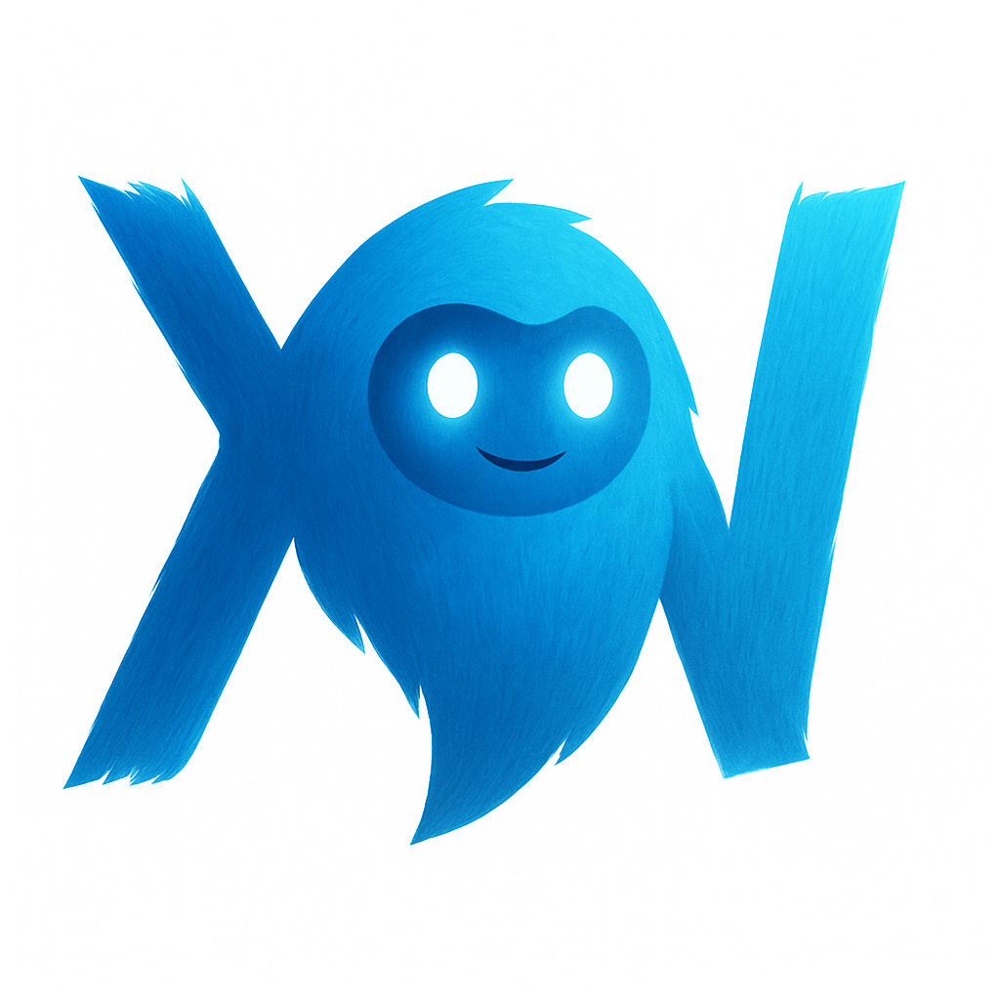

# Yeti – An Agentic Artificial Intelligence Framework



Yeti is a manifestation of pre-human intelligence and brute-force. Yeti is an AI agent who speaks elegantly and performs tasks with ease. Yeti provides complete privacy of thoughts, and does not share any date with 3rd party applications. Yeti can be extended to add functions, api calls, etc to make him more powerful. 

Tested with: **`Mistral-Nemo`**
---

**Why `Mistral-Nemo`?**
1. Mistral Nemo is the most capable open source model at the time of creating this project. Maybe some other models will be more compatible in the future.
---

### Tool Calling
Extend tool-calling feature to increase or customize the application scope. E.g SASS. Currently the agent is able to:
1. Fetch weather for a given city.
2. Get the current date and time.
3. Fetching exchange rates (via private API, not available for public use).
4. Search and summarize results from the internet.
```python
from langchain.agents import tool

@tool
def get_product_price(labubu: int) -> dict:
    """Get the price of a product."""
    return get_product_price(labubu) 
```
```txt
Prompt example: 
Hey, what's the price of labulu? 
### Process: 
- calls the appropriate function get_product_price(labubu), captures the response and send it to the user automaticaly: 
### Response:
==> Ah yes, the price of labubu is 20$.
```


## Roadmap (Planned Features)
1. Text embeddings and vector database for overcoming context limits.  
2. Session and thread IDs for topic-based conversation classification.  
3. Integrated search backend for browsing the internet.  
4. Voice controls and conversational interaction (low priority).  
5. Image analysis (low priority).  

---

## Architecture
- **Host OS**: Runs `llama_cpp` inference (download llama_cpp, an AI model and serve from your OS).
- **Docker**: Runs database, frontend and `FastAPI` backend (docker bundle).
---

## Getting Started
### Clone the Repository
```sh
git clone https://github.com/deepyes02/yeti-ai
```

### Requirements
1. Install `llama_cpp` (compile for your specific architecture; see llama_cpp documentation) on your Operating System. The llama server will run on OS, and communicate with Docker microservices via ports.  
2. Install [`Docker Desktop`](https://www.docker.com/products/docker-desktop/).  
3. Download the **`Mistral-Nemo`** quantized GGUF model from Hugging Face. Also save locally.

4. Serve the model on the OS.
   ```bash
   llama-server -m ~/llms/mistral-nemo-15.gguf --jinja -c 4096
   # Adjust context length based on available GPU
   ```

6. Start frontend, backend and microservices on the container
   ```bash
   docker compose up -d
   ```
   Fires up Next JS frontend, FASTAPI backend and database service.
7. Ensure the model name is correctly configured in [`load_model.py`](./app/utils/load_model.py).

---

## Development Notes

For quick testing codes in [`scripts/`](./scripts/), etc, it is recommended to set up a virtual environment in the project root. Even though not necessary, since docker has it all configured - this is recommended for dev environment for testing out different things without restarting docker, etc.

```sh
python -m venv env   # Python 3.11 recommended
source ./env/bin/activate
pip install -r requirements.txt
```

---

## ChatOpenAI Wrapper
`Mistral-Nemo` is **`OpenAI API`-compatible**. Wrapping it in `LangGraph` works just like using `OpenAI`, except no real API key is required. Just type the name of your dog.

```python
def load_model():
    model = ChatOpenAI(
        base_url="http://localhost:8080/v1",
        model="mistral-nemo",
        api_key=SecretStr("punte"),  # any placeholder string works
        temperature=0.9,
        top_p=0.95,
    )
    return model
```

---

## Running the Application

- **Backend server**: Port `8000`  
- **Frontend server**: Port `3000` (see `docker-compose.yml`)  

Visit: [http://localhost:3000](http://localhost:3000)  


---

## User Interface  
Built on React and NEXT JS, the frontend utilizes websocket to consume and stream responses from the server. The app can hence be fully customized and extended.

## Tested Models
1. **`DeepSeek`**
2. **`Qwen 3`**`LangGraph`  
3. **`Llama 3.2`**
4. **`Granite 3.3 (8B)`** 

## References
- [ReAct: Synergizing Reasoning and Acting in Language Models](https://arxiv.org/abs/2210.03629)
