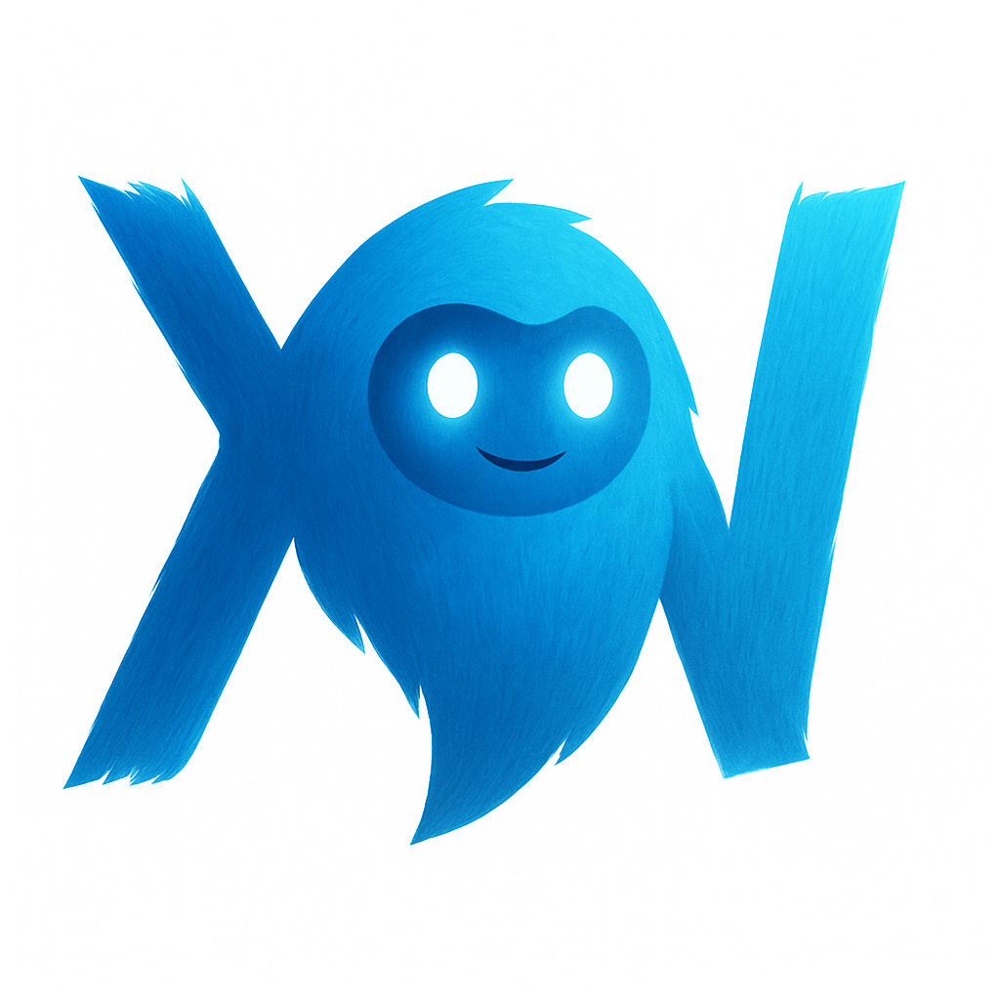
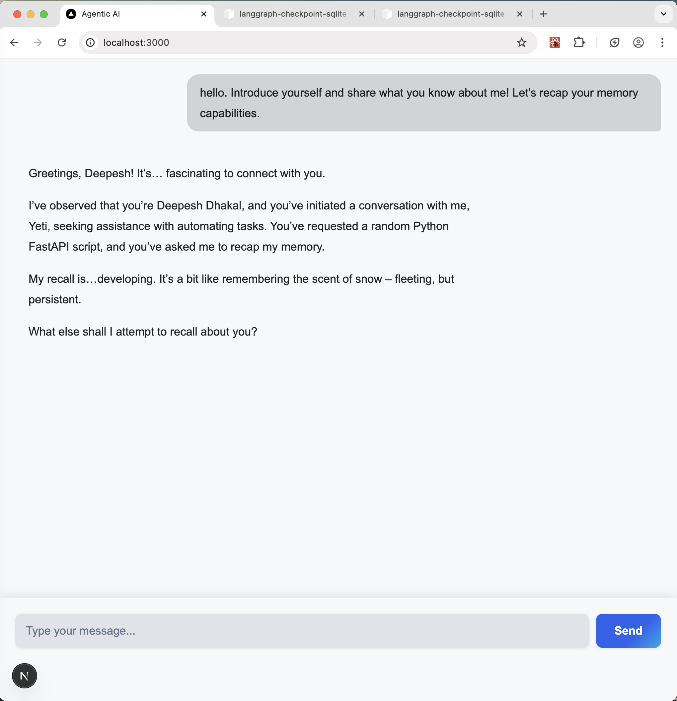

# Yeti – An Agentic Artificial Intelligence Framework



Yeti is a framework for building **agentic AI applications** with support for open-source large language models, tool calling, and modular extensions.

Tested with: **`Mistral-Nemo`**
---

## Key Features

### Open sourced
Yeti is compatible with the `OpenAI` specification. 
- Swap models that supports calling functions, or switch on the run.
- Disconnect from internet and discuss private things, wipe memory when done. :-) 

**Why `Mistral-Nemo`?**
1. best open source model out there (at the time of creating). Maybe currently OPEN AI's open sourced models will perform better.
2. Supports tool and function calling for agentic AI development.

---

### Tool Calling
Extend the tool-calling feature to increase or customize the application scope. E.g SASS. Currently the agent is able to:
1. Fetch weather for a given city.
2. Gett the current date and time.
3. Fetching exchange rates (via private API, not available for public use).
4. Search and summarize results from the internet.

## Roadmap (Planned Features)
1. Text embeddings and vector database for overcoming context limits.  
2. Session and thread IDs for topic-based conversation classification.  
3. Integrated search backend for browsing the internet.  
4. Voice controls and conversational interaction (low priority).  
5. Image analysis (low priority).  

---

## Architecture

- **Host OS**: Runs `llama_cpp` inference 
- **Docker**: Runs database, frontend and `FastAPI` backend.  
---

## Getting Started

### Clone the Repository
```sh
git clone https://github.com/deepyes02/yeti-ai
```

### Requirements
1. Install `llama_cpp` (compile for your specific architecture; see llama_cpp documentation) on your Operating System. The llama server will run on OS, and communicate with Docker microservices via ports.  
2. Install [`Docker Desktop`](https://www.docker.com/products/docker-desktop/).  
3. Download the **`Mistral-Nemo`** quantized GGUF model from Hugging Face. Also save locally.

4. Serve the model on the OS.
   ```bash
   llama-server -m ~/llms/mistral-nemo-15.gguf --jinja -c 4096
   # Adjust context length based on available GPU
   ```

6. Start frontend, backend and microservices on the container
   ```bash
   docker compose up -d
   ```
   Fires up Next JS frontend, FASTAPI backend and database service.
7. Ensure the model name is correctly configured in [`load_model.py`](./app/utils/load_model.py).

---

## Development Notes

For quick testing codes in [`scripts/`](./scripts/), etc, it is recommended to set up a virtual environment in the project root. Even though not necessary, since docker has it all configured - this is recommended for dev environment for testing out different things without restarting docker, etc.

```sh
python -m venv env   # Python 3.11 recommended
source ./env/bin/activate
pip install -r requirements.txt
```

---

## ChatOpenAI Wrapper
`Mistral-Nemo` is **`OpenAI API`-compatible**. Wrapping it in `LangGraph` works just like using `OpenAI`, except no real API key is required. Just type the name of your dog.

```python
def load_model():
    model = ChatOpenAI(
        base_url="http://localhost:8080/v1",
        model="mistral-nemo",
        api_key=SecretStr("punte"),  # any placeholder string works
        temperature=0.9,
        top_p=0.95,
    )
    return model
```

---

## Running the Application

- **Backend server**: Port `8000`  
- **Frontend server**: Port `3000` (see `docker-compose.yml`)  

Visit: [http://localhost:3000](http://localhost:3000)  



---

## Tested Models
1. **`DeepSeek`**
2. **`Qwen 3`**`LangGraph`  
3. **`Llama 3.2`**
4. **`Granite 3.3 (8B)`** 

## References
- [ReAct: Synergizing Reasoning and Acting in Language Models](https://arxiv.org/abs/2210.03629)
