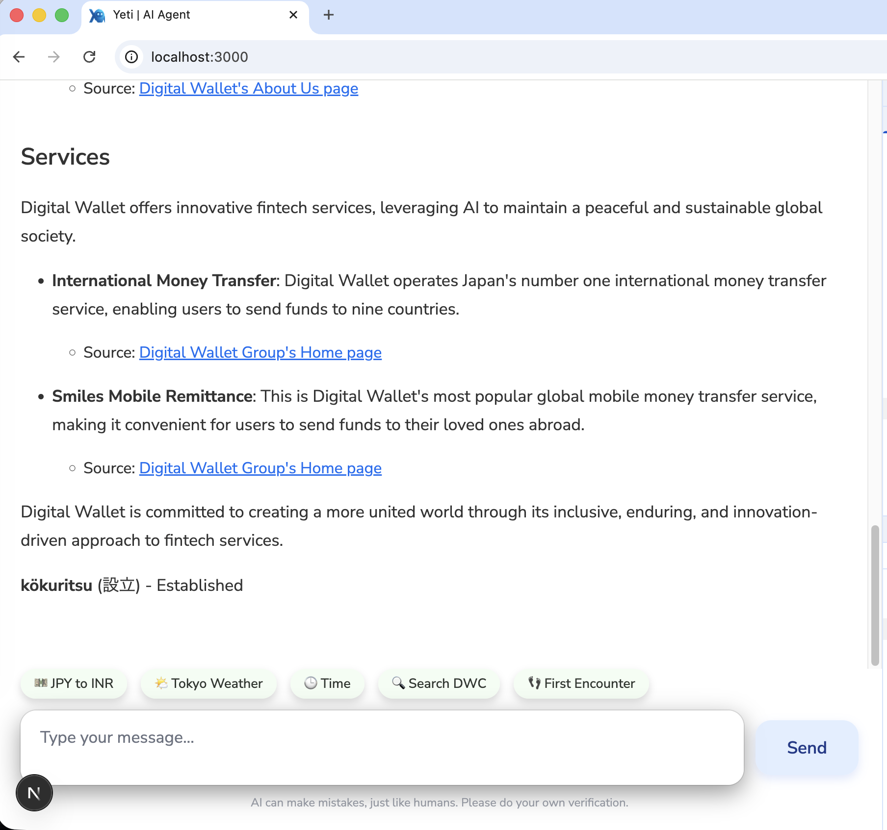

# Yeti – Sovereign AI Agent Framework

> **"Your Data, Your Rules, Your Infrastructure."**

**Yeti** is a foundational framework for **Sovereign AI** development. Unlike standard API wrappers that leak data to third-party providers, Yeti is engineered to run **100% locally** (or on private clouds) while maintaining enterprise-grade capabilities.

The Shipton Footprints (1951): Perhaps the most famous "evidence" ever found. British mountaineer Eric Shipton took photos of massive, humanoid tracks in the snow near Mount Everest. Each print was about 13 inches long and very wide. These photos sparked a "Yeti-mania" that lasted decades. 

**`Mistral-Nemo`** 
Mistral Nemo was good at reasoning and calling functions with less confusion.

## 📄 Key Documentation
- **[Sovereign AI Analysis](./SOVEREIGN_AI_ANALYSIS.md)**: Why Yeti is a technological differentiator in the Japanese market.
- **[Infrastructure Roadmap](./INFRASTRUCTURE_ROADMAP.md)**: Strategy from local R&D (MacBook Pro) to Enterprise deployment (NVIDIA A6000/Cloud).
- **[Changelog](./CHANGELOG.md)**: Latest updates and features.

---

### Tool Calling
Currently the agent is able to:  
1. Fetch weather for a given city (`WeatherAPI`).  
2. Get the current date and time.  
3. Fetch exchange rates (Powered by `Smiles Wallet`).
4. Search and summarize results from the internet (`Tavily`).  

```python
from langchain.agents import tool  

@tool
def get_product_price(labubu: int) -> str:
    """Get the price of a product."""
    return get_price(labubu) 
```
```txt
Prompt example: 
Hey, what's the price of labulu? 
### Process: 
- calls the appropriate function get_product_price(labubu), captures the response and send it to the user automaticaly: 
### Response:
==> Ah yes, the price of labubu is 20$.
```


## Roadmap & TODOs:
1. **RAG (Retrieval Augmented Generation)**: Connect to vector DB for long-term memory.  
2. **Multi-User Sessions**: Enhanced authentication.  
3. [x] **Better Search**: Integrated Tavily for citation-backed web browsing.
4. Voice controls (low priority).
5. Image analysis (low priority).  
---

## Architecture (Sovereign by Design)
- **Model Engine**: Runs `llama_server` (GGUF) locally. No external inference API.
- **Orchestration**: `LangGraph` for custom, cyclic agentic workflows.
- **Persistence**: `PostgreSQL` container for data ownership.
- **Microservices**: Dockerized `FastAPI` backend and `Next.js` frontend.
---

### Clone the Repository

### Requirements
1. Install [`llama_cpp`](https://github.com/ggml-org/llama.cpp)
2. Install [`Docker Desktop`](https://www.docker.com/products/docker-desktop/). 
3. Download appropriate [`Mistral-Nemo`](https://huggingface.co/bartowski/Mistral-Nemo-Instruct-2407-GGUF) quantized GGUF model from Hugging Face. 

4. Serve the model on your OS.
   ```bash
   llama-server -m ~/llms/mistral-nemo-15.gguf --jinja -c 4096
   # Adjust context length based on available GPU
   ```

5. Start frontend, backend and microservices on the container
**Make sure the llama server is running before starting the containers**
From the root directory of the project, run:
   ```bash
   docker compose up -d
   ```
   Fires up Next JS frontend, FASTAPI backend and database service.
6. Ensure the model name is correctly configured in [`load_model.py`](./app/utils/load_model.py).

---
---

## Accessing the Application

- **Backend server**: Port `8000`  
- **Frontend server**: Port `3000` (see `docker-compose.yml`)  

Visit: [http://localhost:3000](http://localhost:3000)  



---

## Development Notes

There are various notebooks and scripts for local testing in [`scripts/`](./scripts/), I set up a virtual environment in the project root and install the requirements.txt locally so it helps to execute those tests locally. It is not necessary to do this.

```sh
python -m venv env   # Python 3.11 recommended
source ./env/bin/activate
pip install -r requirements.txt
```
---

## ChatOpenAI Wrapper
Yeti uses **`OpenAI API`-compatible** models. So, wrapping it in `LangGraph` works just like using `OpenAI`, with random api_key

```python
def load_model():
    model = ChatOpenAI(
        base_url="http://localhost:8080/v1",
        model="mistral-nemo",
        api_key=SecretStr("free_api_key_string"),  # no need for OPEN API key
        temperature=0.9,
        top_p=0.95,
    )
    return model
```

## User Interface  
Built on React and NEXT JS, the frontend utilizes websocket to consume and stream responses from the server. The app can hence be fully customized and extended.

## Attach and Debug

I normally attach to the running docker containers to debug backend logs and errors while developing, it is helpful.

## Tested Models
I tested these other models during the project, they work but Mistral Nemo was the best.
1. **`DeepSeek`**
2. **`Qwen 3`**`LangGraph`  
3. **`Llama 3.2`**
4. **`Granite 3.3 (8B)`** 

## Reference
- [ReAct: Synergizing Reasoning and Acting in Language Models](https://arxiv.org/abs/2210.03629)
